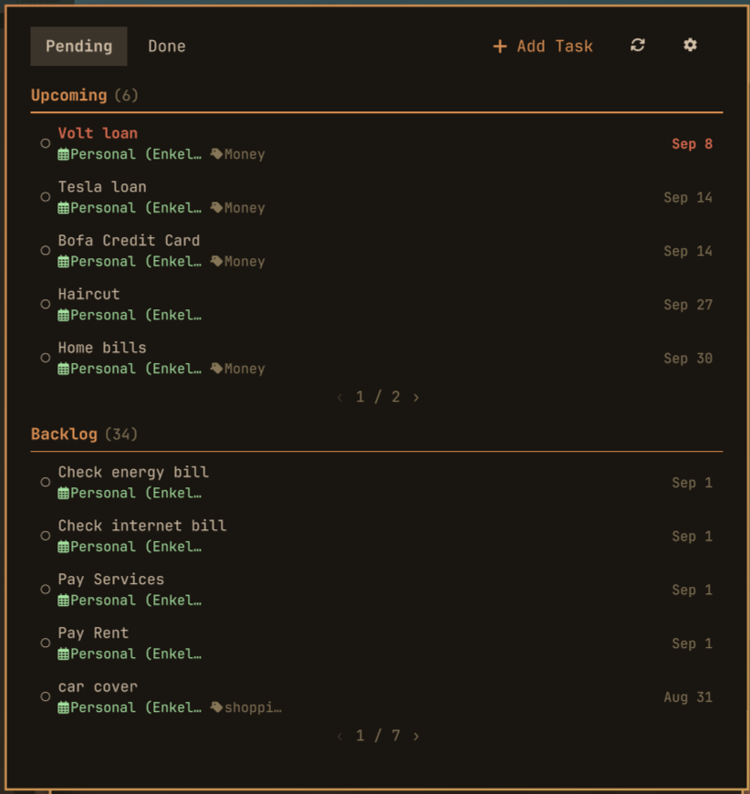
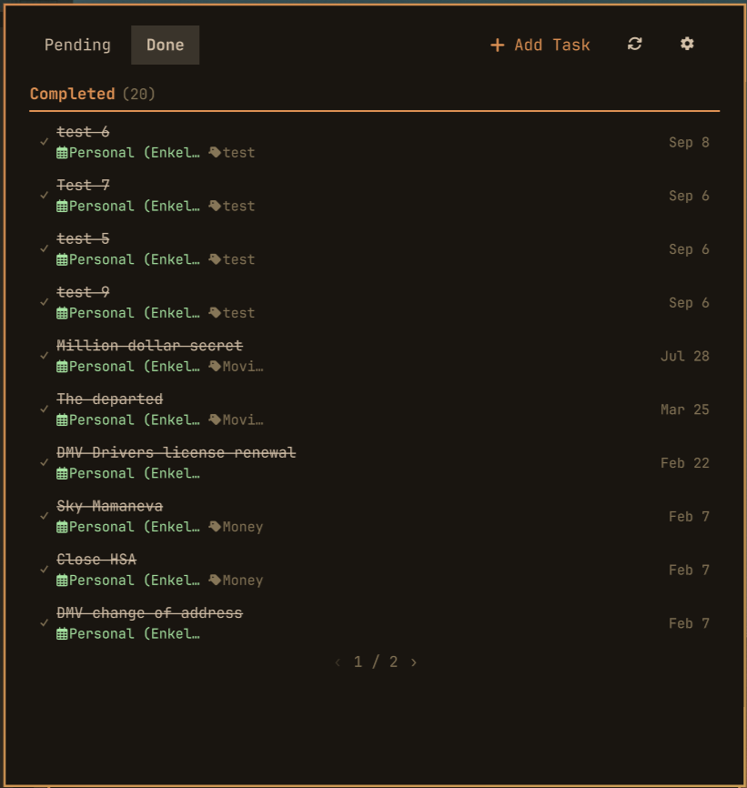
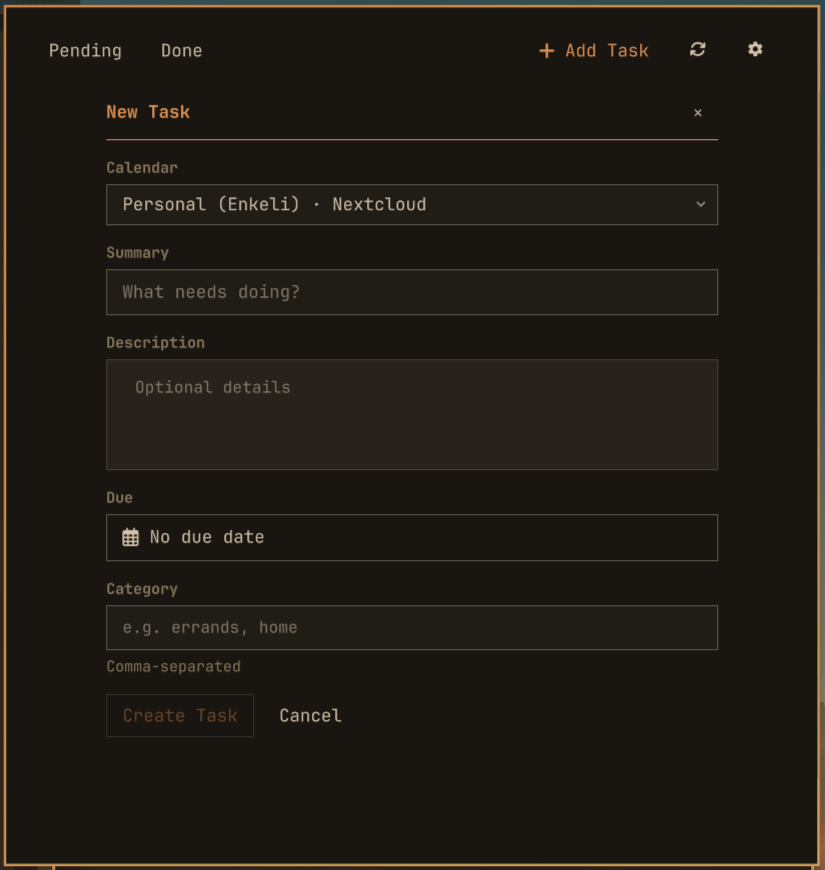
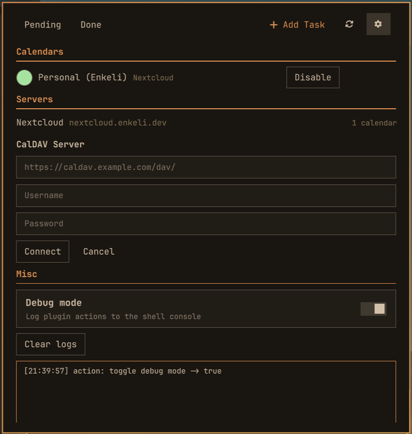

# Nextcloud Tasks

A task widget for the Omarchy shell. Sync with Nextcloud Tasks and manage your to-do list from the bar.

## Previews

| Browse pending tasks | Completed tasks |
| :---: | :---: |
|  |  |
|  |  |

## Install

```bash
omarchy plugin add https://github.com/enkeli/omarchy-dav-tasks --enable
```

## What it does

- View and manage Nextcloud Tasks lists
- Create, edit, and complete tasks
- Two-way sync with your Nextcloud server

## Uninstall

```bash
omarchy plugin disable dev.enkeli.omarchy-dav-tasks
omarchy plugin remove dev.enkeli.omarchy-dav-tasks
```

## Requirements

Omarchy 4, Python 3, and Evolution Data Server (already on Omarchy). License: MIT.

Credentials stay in the system keyring. They are never written to `shell.json` or this repo.

## Development

```bash
./test/all
omarchy plugin validate .
```
